<!-- HEADER -->
<picture>
  <source media="(prefers-color-scheme: dark)" srcset="dark.svg" />
  <source media="(prefers-color-scheme: light)" srcset="light.svg" />
  
</picture>

  <em>Full-Stack Developer | Web Enthusiast | Problem Solver</em>

<!-- SOCIAL BADGES -->

  
  
  
  

---

<!-- ABOUT ME -->
## 👋 Tentang Saya | About Me

**ID:**  
Hai! Saya Arhinza Wahyu Styawan, seorang Full-Stack Developer yang antusias dengan pengembangan web modern. Fokus utama saya adalah membangun aplikasi web yang responsif, performant, dan user-friendly. Selalu belajar hal baru dan terus berkembang.

**EN:**  
Hi! I'm Arhinza Wahyu Styawan, a Full-Stack Developer passionate about modern web development. My main focus is building responsive, performant, and user-friendly web applications. Always learning and continuously improving.

---

<!-- TECH STACK -->
## 🛠️ Tech Stack

  
  
  
  

  
  
  
  

---

<!-- STATS -->
## 📊 GitHub Stats

  
  

  

---

<!-- CONTRIBUTION SNAKE -->
<picture>
  <source media="(prefers-color-scheme: dark)" srcset="https://raw.githubusercontent.com/arhinzawahyu/arhinzawahyu/output/github-snake-dark.svg" />
  <source media="(prefers-color-scheme: light)" srcset="https://raw.githubusercontent.com/arhinzawahyu/arhinzawahyu/output/github-snake.svg" />
  
</picture>

---

<!-- QUOTE -->

  <i>"Try to be better every day."</i>

